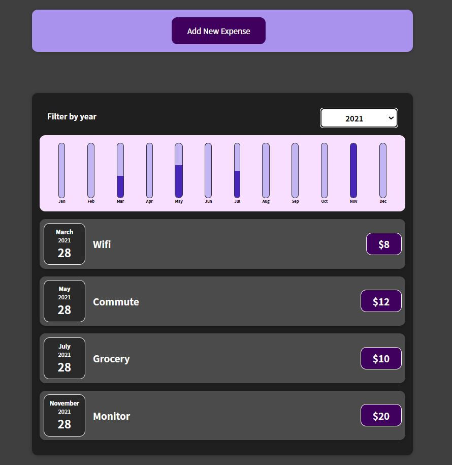
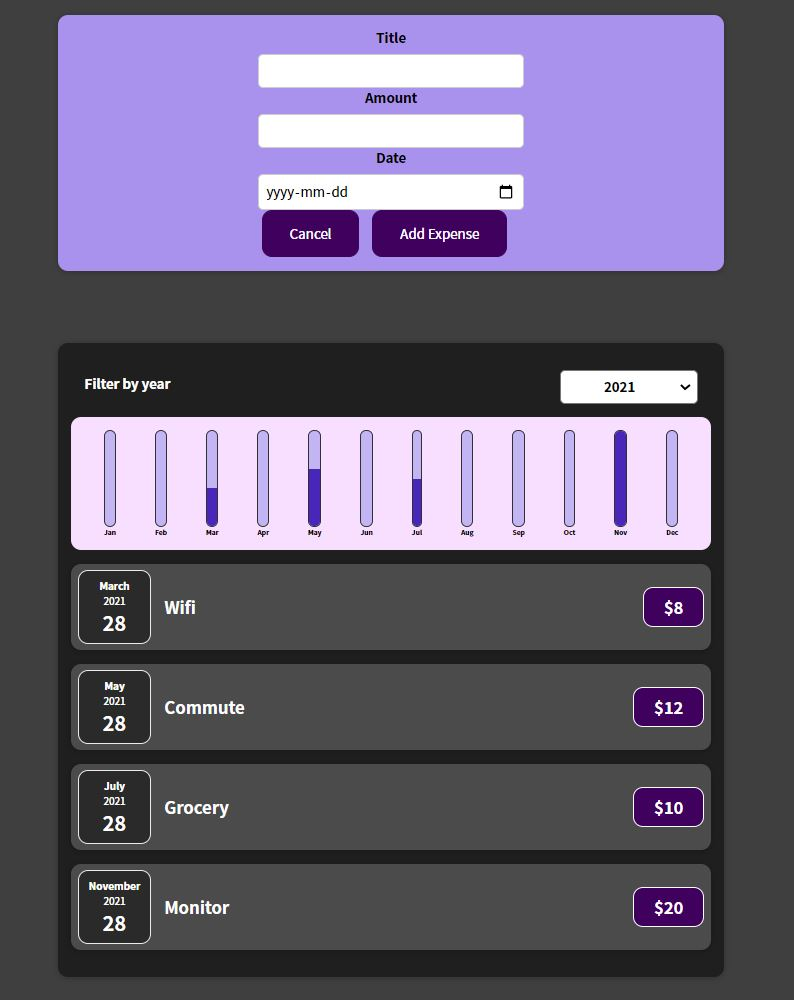

## Key Learnings

- Fully understood and implemented React fundamentals, react hook.
- Implemented the basics of Node.js.
- Used Semantic HTML.
- Flexbox, SASS.


## Installation

### Clone

- Clone this repo to your local machine using `https://github.com/dennisagarwal/expense-application.git`

### Setup

 **1.** Navigate to the express-application folder in your terminal and install npm like this:

```
$ npm install
```
### Launch application

```
$ npm start
```

## Tech Stack

- React JS.
- React Hook.
- Node.js
- APIs.
- HTML.
- Flexbox, SASS.


#### Website Glimpse

 **1.** Landing Page

 

  **2.** Landing Page with form

 


 ##### Website Link

 https://hungry-hodgkin-037c05.netlify.app/
